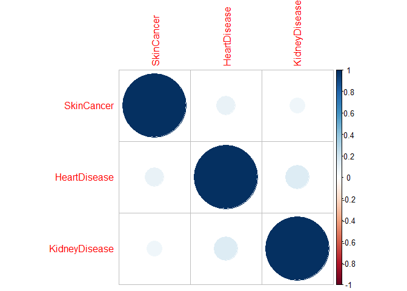
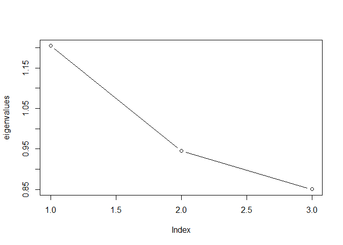
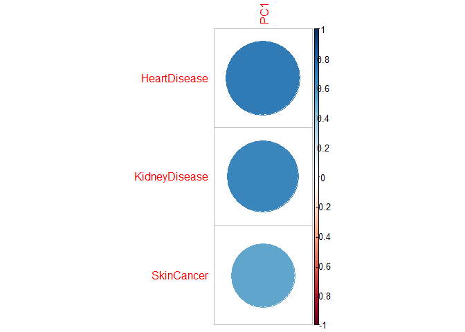
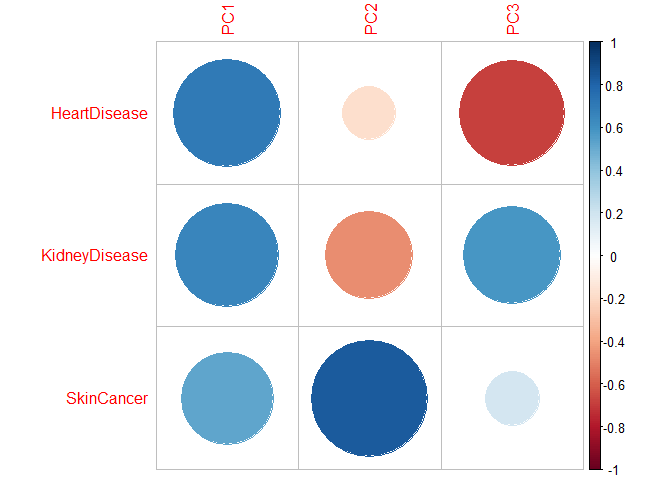
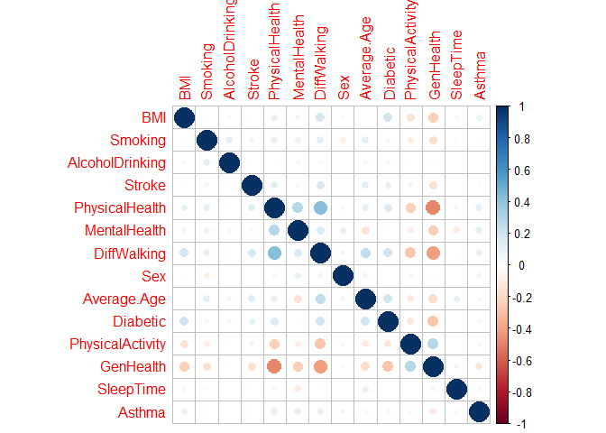
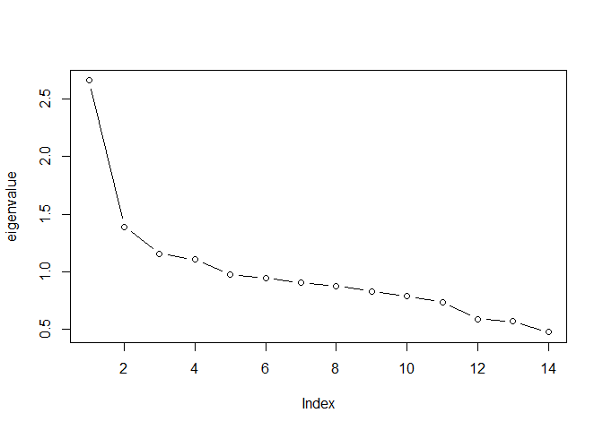
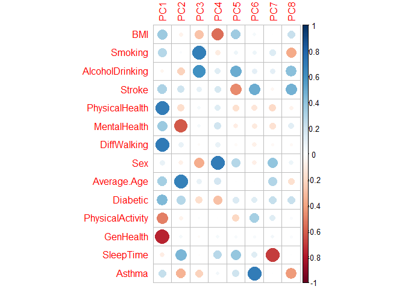

```r
if(!require(installr)) {
  install.packages("installr"); 
  require(installr)}
```

```
## Loading required package: installr
```

```
## Warning: package 'installr' was built under R version 4.1.3
```

```
## 
## Welcome to installr version 0.23.4
## 
## More information is available on the installr project website:
## https://github.com/talgalili/installr/
## 
## Contact: <tal.galili@gmail.com>
## Suggestions and bug-reports can be submitted at: https://github.com/talgalili/installr/issues
## 
## 			To suppress this message use:
## 			suppressPackageStartupMessages(library(installr))
```


```r
library(rmarkdown); library(knitr); library(readxl)
```

```
## Warning: package 'readxl' was built under R version 4.1.3
```

```r
library(moments); library(corrplot); library(pso);
```

```
## Warning: package 'moments' was built under R version 4.1.3
```

```
## Warning: package 'corrplot' was built under R version 4.1.3
```

```
## corrplot 0.92 loaded
```

```
## Warning: package 'pso' was built under R version 4.1.3
```

```r
library(GPArotation); library(lavaan); library(scatterplot3d);
```

```
## Warning: package 'GPArotation' was built under R version 4.1.3
```

```
## Warning: package 'lavaan' was built under R version 4.1.3
```

```
## This is lavaan 0.6-14
## lavaan is FREE software! Please report any bugs.
```

```
## Warning: package 'scatterplot3d' was built under R version 4.1.3
```

```r
library(corrplot);library(moments); library(psych)
```

```
## Warning: package 'psych' was built under R version 4.1.3
```

```
## 
## Attaching package: 'psych'
```

```
## The following object is masked from 'package:lavaan':
## 
##     cor2cov
```


```r
diseasesdata<-  read.csv("Heart Disease Data Updated.csv")
head(diseasesdata)
```

```
##   HeartDisease   BMI Smoking AlcoholDrinking Stroke PhysicalHealth MentalHealth
## 1            0 16.60       1               0      0              3           30
## 2            0 20.34       0               0      1              0            0
## 3            0 26.58       1               0      0             20           30
## 4            0 24.21       0               0      0              0            0
## 5            0 23.71       0               0      0             28            0
## 6            1 28.87       1               0      0              6            0
##   DiffWalking Sex Average.Age Diabetic PhysicalActivity GenHealth SleepTime
## 1           0   1          57        1                1         4         5
## 2           0   1          82        0                1         4         7
## 3           0   0          67        1                1         2         8
## 4           0   1          77        0                0         3         6
## 5           1   1          42        0                1         4         8
## 6           1   1          77        0                0         2        12
##   Asthma KidneyDisease SkinCancer
## 1      1             0          1
## 2      0             0          0
## 3      1             0          0
## 4      0             0          1
## 5      0             0          0
## 6      0             0          0
```

```r
dim(diseasesdata)
```

```
## [1] 319795     17
```

```r
diseasedata<-as.matrix(diseasesdata) 
dis<-diseasesdata[,-c(2:15)]
head(dis)
```

```
##   HeartDisease KidneyDisease SkinCancer
## 1            0             0          1
## 2            0             0          0
## 3            0             0          0
## 4            0             0          1
## 5            0             0          0
## 6            1             0          0
```


```r
#Response variables analysis
cordis<- cor(dis)
cordis
```

```
##               HeartDisease KidneyDisease SkinCancer
## HeartDisease    1.00000000    0.14519710 0.09331688
## KidneyDisease   0.14519710    1.00000000 0.06181622
## SkinCancer      0.09331688    0.06181622 1.00000000
```

```r
corrplot(cordis, order = "hclust")
```

<!-- -->


```r
#Eigen values
eigen(cordis)
```

```
## eigen() decomposition
## $values
## [1] 1.2044613 0.9452896 0.8502492
## 
## $vectors
##            [,1]       [,2]       [,3]
## [1,] -0.6432356 -0.1833456  0.7433924
## [2,] -0.6004332 -0.4816736 -0.6383342
## [3,] -0.4751083  0.8569568 -0.1997428
```

```r
eigenvalues <- eigen(cordis)$values
eigenvalues
```

```
## [1] 1.2044613 0.9452896 0.8502492
```

```r
plot(eigenvalues,type="b")
cordei<- eigen(cordis)$vectors
cordei
```

```
##            [,1]       [,2]       [,3]
## [1,] -0.6432356 -0.1833456  0.7433924
## [2,] -0.6004332 -0.4816736 -0.6383342
## [3,] -0.4751083  0.8569568 -0.1997428
```

```r
#Kaiser's criterion: retain 1  factors
sum(eigen(cordis)$values>1.0)
```

```
## [1] 1
```

```r
#Joliffe's criterion: retain 3 factors. Huge difference between the number of clusters each criterion suggests.
sum(eigen(cordis)$values>0.7)
```

```
## [1] 3
```

```r
#Inflection point
plot(eigenvalues,type="b")
```

<!-- -->

```r
#The intrinsic dimensionality is 1 clusters as the inflection point is the second point from the left of the graph
```


```r
#reduced matrix of eigen values
cods<- diag(eigen(cordis)$values[1:3])
head(cods)
```

```
##          [,1]      [,2]      [,3]
## [1,] 1.204461 0.0000000 0.0000000
## [2,] 0.000000 0.9452896 0.0000000
## [3,] 0.000000 0.0000000 0.8502492
```

```r
#unrotated matrix
cosa <-cordei %*% sqrt(cods)
head(cosa)
```

```
##            [,1]       [,2]       [,3]
## [1,] -0.7059379 -0.1782596  0.6854744
## [2,] -0.6589631 -0.4683120 -0.5886013
## [3,] -0.5214216  0.8331848 -0.1841808
```

```r
dob <- solve(cordis)%*% cosa
head(dob)
```

```
##                     [,1]       [,2]       [,3]
## HeartDisease  -0.5861026 -0.1885767  0.8062042
## KidneyDisease -0.5471020 -0.4954165 -0.6922691
## SkinCancer    -0.4329086  0.8814070 -0.2166198
```

```r
coz <-scale(dis)
head(coz)
```

```
##      HeartDisease KidneyDisease SkinCancer
## [1,]   -0.3059536    -0.1955541  3.1184143
## [2,]   -0.3059536    -0.1955541 -0.3206748
## [3,]   -0.3059536    -0.1955541 -0.3206748
## [4,]   -0.3059536    -0.1955541  3.1184143
## [5,]   -0.3059536    -0.1955541 -0.3206748
## [6,]    3.2684598    -0.1955541 -0.3206748
```

```r
fdis <- coz%*%dob
head(fdis)
```

```
##            [,1]       [,2]        [,3]
## [1,] -1.0636801  2.9031685 -0.78679518
## [2,]  0.4251311 -0.1280686 -0.04182046
## [3,]  0.4251311 -0.1280686 -0.04182046
## [4,] -1.0636801  2.9031685 -0.78679518
## [5,]  0.4251311 -0.1280686 -0.04182046
## [6,] -1.6698420 -0.8021197  2.83988641
```

```r
 #unrotated matrix for one factor(Kaisser and Scree Plot)
roai1 <-pca(r=cordis, nfactors=1, rotate = "none")$loadings[]
roai1
```

```
##                     PC1
## HeartDisease  0.7059379
## KidneyDisease 0.6589631
## SkinCancer    0.5214216
```

```r
corrplot(roai1)    #visualize the loadings on each factor
```

<!-- -->

```r
#let's check for any complex dimensions

which(rowSums(abs(roai1)>.3)>=2)
```

```
## named integer(0)
```

```r
#no complexity!

roai1vx<-pca(r=cordis, nfactors=1,rotate="varimax")$loading[] #orthogonal varimax rotation
roai1vx
```

```
##                     PC1
## HeartDisease  0.7059379
## KidneyDisease 0.6589631
## SkinCancer    0.5214216
```

```r
#No need for a varimax rotation, there is no complexity

#let's check for any remaining complexities
which(rowSums(abs(roai1vx)>.3)>=2)
```

```
## named integer(0)
```

```r
#There are no remaining complexities 

 #unrotated matrix for three factors (Jollife)
roai3<-pca(r=cordis, nfactors=3, rotate = "none")$loadings[]
roai3
```

```
##                     PC1        PC2        PC3
## HeartDisease  0.7059379 -0.1782596 -0.6854744
## KidneyDisease 0.6589631 -0.4683120  0.5886013
## SkinCancer    0.5214216  0.8331848  0.1841808
```

```r
corrplot(roai3)    #visualize the loadings on each factor
```

<!-- -->

```r
#let's check for any complex dimensions

which(rowSums(abs(roai3)>.3)>=2)
```

```
##  HeartDisease KidneyDisease    SkinCancer 
##             1             2             3
```

```r
#All the 3 dimensions are complex.

roai3vx<-pca(r=cordis, nfactors=3,rotate="varimax")$loading[] #orthogonal varimax rotation
roai3vx
```

```
##                      RC2        RC3        RC1
## HeartDisease  0.04615905 0.99632872 0.07210004
## KidneyDisease 0.02993201 0.07220106 0.99694086
## SkinCancer    0.99855900 0.04531833 0.02874323
```

```r
#let's check for any remaining complexities
which(rowSums(abs(roai3vx)>.3)>=2)
```

```
## named integer(0)
```

```r
#All the complexities have been removed.The varimax rotation was successful.
```

#3 Let's try optimal oblique rotation and it is it necessary?

```r
#based on Kaiser and Scree Plot's criterion
pca(r=cordis, nfactors=1,rotate="oblimin")
```

```
## Principal Components Analysis
## Call: principal(r = r, nfactors = nfactors, residuals = residuals, 
##     rotate = rotate, n.obs = n.obs, covar = covar, scores = scores, 
##     missing = missing, impute = impute, oblique.scores = oblique.scores, 
##     method = method, use = use, cor = cor, correct = 0.5, weight = NULL)
## Standardized loadings (pattern matrix) based upon correlation matrix
##                PC1   h2   u2 com
## HeartDisease  0.71 0.50 0.50   1
## KidneyDisease 0.66 0.43 0.57   1
## SkinCancer    0.52 0.27 0.73   1
## 
##                PC1
## SS loadings    1.2
## Proportion Var 0.4
## 
## Mean item complexity =  1
## Test of the hypothesis that 1 component is sufficient.
## 
## The root mean square of the residuals (RMSR) is  0.29 
## 
## Fit based upon off diagonal values = -6.65
```

```r
oblicordis<-pca(r=cordis, nfactors=1,rotate="oblimin")$loading[] #oblique varimax rotation
oblicordis
```

```
##                     PC1
## HeartDisease  0.7059379
## KidneyDisease 0.6589631
## SkinCancer    0.5214216
```

```r
#40% of the data was retained

which(rowSums(abs(oblicordis)>.3)>=2)
```

```
## named integer(0)
```

```r
#After oblique rotation, there are no complexities. This rotation was successful.

#based on Jolliffe's criterion
pca(r=cordis, nfactors=3,rotate="oblimin")
```

```
## Principal Components Analysis
## Call: principal(r = r, nfactors = nfactors, residuals = residuals, 
##     rotate = rotate, n.obs = n.obs, covar = covar, scores = scores, 
##     missing = missing, impute = impute, oblique.scores = oblique.scores, 
##     method = method, use = use, cor = cor, correct = 0.5, weight = NULL)
## Standardized loadings (pattern matrix) based upon correlation matrix
##               TC2 TC1 TC3 h2       u2 com
## HeartDisease    0   0   1  1 -2.2e-16   1
## KidneyDisease   0   1   0  1 -4.4e-16   1
## SkinCancer      1   0   0  1 -4.4e-16   1
## 
##                        TC2  TC1  TC3
## SS loadings           1.00 1.00 1.00
## Proportion Var        0.33 0.33 0.33
## Cumulative Var        0.33 0.67 1.00
## Proportion Explained  0.33 0.33 0.33
## Cumulative Proportion 0.33 0.67 1.00
## 
##  With component correlations of 
##      TC2  TC1  TC3
## TC2 1.00 0.06 0.09
## TC1 0.06 1.00 0.15
## TC3 0.09 0.15 1.00
## 
## Mean item complexity =  1
## Test of the hypothesis that 3 components are sufficient.
## 
## The root mean square of the residuals (RMSR) is  0 
## 
## Fit based upon off diagonal values = 1
```

```r
oblicordis2<-pca(r=cordis, nfactors=3,rotate="oblimin")$loading[] #oblique varimax rotation
oblicordis2
```

```
##                         TC2           TC1           TC3
## HeartDisease   7.135831e-07  2.008882e-07  9.999999e-01
## KidneyDisease -1.971576e-06  1.000000e+00  2.656441e-07
## SkinCancer     1.000001e+00 -1.071669e-06 -7.137826e-06
```

```r
#100% of the data was retained

which(rowSums(abs(oblicordis2)>.3)>=2)
```

```
## named integer(0)
```

```r
#After oblique rotation, there are no complexities. This rotation was successful.

#The oblique rotation is not going to be used for this factor analysis because the correlation between factors is less 0.3 and this is not a significant correlation for us to use. 
#Therefore orthogonal rotation will be the best used going forward.
```

#summarize and interpret variance

```r
#Based on the analysis above, we select orthogonal rotation based on inflection point criterion because it leaves us with the lowest number of complex dimensions.

#Kaiser and Scree Plot
pca(r=cordis, nfactors=1,rotate="varimax") 
```

```
## Principal Components Analysis
## Call: principal(r = r, nfactors = nfactors, residuals = residuals, 
##     rotate = rotate, n.obs = n.obs, covar = covar, scores = scores, 
##     missing = missing, impute = impute, oblique.scores = oblique.scores, 
##     method = method, use = use, cor = cor, correct = 0.5, weight = NULL)
## Standardized loadings (pattern matrix) based upon correlation matrix
##                PC1   h2   u2 com
## HeartDisease  0.71 0.50 0.50   1
## KidneyDisease 0.66 0.43 0.57   1
## SkinCancer    0.52 0.27 0.73   1
## 
##                PC1
## SS loadings    1.2
## Proportion Var 0.4
## 
## Mean item complexity =  1
## Test of the hypothesis that 1 component is sufficient.
## 
## The root mean square of the residuals (RMSR) is  0.29 
## 
## Fit based upon off diagonal values = -6.65
```

```r
#Here's the variance in our data that was retained in each row :
# 50% in Heart Disease
# 43% in Kidney Disease
# 27% in Skin Cancer
# 40% of variability of data is accounted for the one factor therefore, we've lost around 60% of our data which is beyond the acceptable threshold.

#Joliffe
pca(r=cordis, nfactors=3,rotate="varimax") 
```

```
## Principal Components Analysis
## Call: principal(r = r, nfactors = nfactors, residuals = residuals, 
##     rotate = rotate, n.obs = n.obs, covar = covar, scores = scores, 
##     missing = missing, impute = impute, oblique.scores = oblique.scores, 
##     method = method, use = use, cor = cor, correct = 0.5, weight = NULL)
## Standardized loadings (pattern matrix) based upon correlation matrix
##                RC2  RC3  RC1 h2       u2 com
## HeartDisease  0.05 1.00 0.07  1 -2.2e-16   1
## KidneyDisease 0.03 0.07 1.00  1 -4.4e-16   1
## SkinCancer    1.00 0.05 0.03  1 -4.4e-16   1
## 
##                        RC2  RC3  RC1
## SS loadings           1.00 1.00 1.00
## Proportion Var        0.33 0.33 0.33
## Cumulative Var        0.33 0.67 1.00
## Proportion Explained  0.33 0.33 0.33
## Cumulative Proportion 0.33 0.67 1.00
## 
## Mean item complexity =  1
## Test of the hypothesis that 3 components are sufficient.
## 
## The root mean square of the residuals (RMSR) is  0 
## 
## Fit based upon off diagonal values = 1
```

```r
#Here's the variance in our data that was retained in each row :
# 100% in Heart Disease
# 100% in Kidney Disease
# 100% in Skin Cancer
# 33% of variability of data is accounted for by each of the three factors therefore, we've lost around 1% of our data which is within the acceptable threshold.
```


```r
#Analysis of variance and communality based on other criteria.

#Kaiser and scree plot's
pca(r=cordis,nfactors=1, rotate="none")
```

```
## Principal Components Analysis
## Call: principal(r = r, nfactors = nfactors, residuals = residuals, 
##     rotate = rotate, n.obs = n.obs, covar = covar, scores = scores, 
##     missing = missing, impute = impute, oblique.scores = oblique.scores, 
##     method = method, use = use, cor = cor, correct = 0.5, weight = NULL)
## Standardized loadings (pattern matrix) based upon correlation matrix
##                PC1   h2   u2 com
## HeartDisease  0.71 0.50 0.50   1
## KidneyDisease 0.66 0.43 0.57   1
## SkinCancer    0.52 0.27 0.73   1
## 
##                PC1
## SS loadings    1.2
## Proportion Var 0.4
## 
## Mean item complexity =  1
## Test of the hypothesis that 1 component is sufficient.
## 
## The root mean square of the residuals (RMSR) is  0.29 
## 
## Fit based upon off diagonal values = -6.65
```

```r
#the single factor retains 40% of the original data (variance)

#jolliffe's 
pca(r=cordis,nfactors=3, rotate="none")
```

```
## Principal Components Analysis
## Call: principal(r = r, nfactors = nfactors, residuals = residuals, 
##     rotate = rotate, n.obs = n.obs, covar = covar, scores = scores, 
##     missing = missing, impute = impute, oblique.scores = oblique.scores, 
##     method = method, use = use, cor = cor, correct = 0.5, weight = NULL)
## Standardized loadings (pattern matrix) based upon correlation matrix
##                PC1   PC2   PC3 h2       u2 com
## HeartDisease  0.71 -0.18 -0.69  1 -2.2e-16 2.1
## KidneyDisease 0.66 -0.47  0.59  1 -4.4e-16 2.8
## SkinCancer    0.52  0.83  0.18  1 -4.4e-16 1.8
## 
##                       PC1  PC2  PC3
## SS loadings           1.2 0.95 0.85
## Proportion Var        0.4 0.32 0.28
## Cumulative Var        0.4 0.72 1.00
## Proportion Explained  0.4 0.32 0.28
## Cumulative Proportion 0.4 0.72 1.00
## 
## Mean item complexity =  2.2
## Test of the hypothesis that 3 components are sufficient.
## 
## The root mean square of the residuals (RMSR) is  0 
## 
## Fit based upon off diagonal values = 1
```

```r
#the 3 factors retain 100% of the original data, which is actually impressive (variance)
```


#Predictors


```r
#Predictor variables analysis

predictordata<-diseasedata[,-c(1,16,17)]
head(predictordata)
```

```
##        BMI Smoking AlcoholDrinking Stroke PhysicalHealth MentalHealth
## [1,] 16.60       1               0      0              3           30
## [2,] 20.34       0               0      1              0            0
## [3,] 26.58       1               0      0             20           30
## [4,] 24.21       0               0      0              0            0
## [5,] 23.71       0               0      0             28            0
## [6,] 28.87       1               0      0              6            0
##      DiffWalking Sex Average.Age Diabetic PhysicalActivity GenHealth SleepTime
## [1,]           0   1          57        1                1         4         5
## [2,]           0   1          82        0                1         4         7
## [3,]           0   0          67        1                1         2         8
## [4,]           0   1          77        0                0         3         6
## [5,]           1   1          42        0                1         4         8
## [6,]           1   1          77        0                0         2        12
##      Asthma
## [1,]      1
## [2,]      0
## [3,]      1
## [4,]      0
## [5,]      0
## [6,]      0
```

```r
dim(predictordata)
```

```
## [1] 319795     14
```

```r
R<-cor(predictordata)
corrplot(R)
```

<!-- -->

```r
#Eigen values
eigen(cor(predictordata))$values
```

```
##  [1] 2.6609413 1.3914757 1.1550720 1.1052597 0.9739275 0.9471217 0.9050526
##  [8] 0.8756531 0.8292909 0.7852854 0.7365916 0.5897894 0.5695995 0.4749396
```

```r
#Kaiser's criterion: retain 4  factors
#Joliffe's criterion: retain 11 factors. Huge difference between the number of clusters each criterion suggests.
#Inflection point

eigenvalue<-c(2.6609413,1.3914757,1.1550720,1.1052597,0.9739275,0.9471217,0.9050526,0.8756531,0.8292909,0.7852854,0.7365916,0.5897894,0.5695995,0.4749396)

plot(eigenvalue,type="b")
```

<!-- -->

```r
#The intrinsic dimensionality is 2 clusters as the inflection point is the third point from the left of the graph
```

```r
#We decided to go with the number of factors between what Kaiser ,which had 4, and Joliffee, which had 11, suggest. We decided to retain 8 factors.

chosenmatrix<-pca(r=R,nfactors=8, rotate="none")$loadings[]   #unrotated matrix
chosenmatrix
```

```
##                          PC1         PC2         PC3          PC4          PC5
## BMI               0.36608092 -0.06797331 -0.28617019 -0.551524875  0.355996322
## Smoking           0.28256315  0.02671103  0.68174377 -0.100965209  0.074162431
## AlcoholDrinking  -0.05101072 -0.22442884  0.60326229  0.133606654  0.495179827
## Stroke            0.31947475  0.20575579  0.10652781  0.174436920 -0.478653410
## PhysicalHealth    0.69582408 -0.17530666  0.04325940  0.139690992 -0.160793671
## MentalHealth      0.36734312 -0.61786895  0.04699372  0.190833614 -0.092191763
## DiffWalking       0.70799519  0.09626778 -0.02038502  0.097998011 -0.028739211
## Sex               0.09845815 -0.07591922 -0.36836522  0.692090529  0.282302885
## Average.Age       0.33195486  0.67254557  0.09919290  0.180121592  0.009925834
## Diabetic          0.44757920  0.28521676 -0.17558271 -0.295328442  0.159192459
## PhysicalActivity -0.50247094 -0.06985482  0.01632472  0.004743654 -0.201654226
## GenHealth        -0.76574117  0.04693344 -0.02341429  0.046808071  0.030954761
## SleepTime        -0.09019855  0.45453427 -0.01308605  0.271426125  0.380272471
## Asthma            0.23422454 -0.34432903 -0.22646795  0.050346577  0.202080707
##                          PC6          PC7          PC8
## BMI               0.04379374  0.001817839  0.227844256
## Smoking           0.07435764  0.148053113 -0.372490335
## AlcoholDrinking   0.11308668  0.114224496  0.419365091
## Stroke            0.49435713 -0.048579280  0.473013045
## PhysicalHealth   -0.13655779 -0.191640875 -0.062140616
## MentalHealth     -0.11391561 -0.154625995  0.125562986
## DiffWalking      -0.07960273 -0.039487623 -0.038710733
## Sex              -0.08144139  0.394036756  0.076794354
## Average.Age      -0.00766684  0.291508600 -0.165415317
## Diabetic          0.13139609  0.236184777  0.223450562
## PhysicalActivity  0.33397355  0.132721102  0.029162513
## GenHealth         0.03649304  0.055448070  0.028727435
## SleepTime         0.13624247 -0.699110877  0.001853645
## Asthma            0.69939065  0.007540763 -0.423541863
```

```r
corrplot(chosenmatrix)    #visualize the loadings on each factor
```

<!-- -->

```r
#let's check for any complex dimensions

which(rowSums(abs(chosenmatrix)>.3)>=2)
```

```
##              BMI          Smoking  AlcoholDrinking           Stroke 
##                1                2                3                4 
##     MentalHealth              Sex      Average.Age PhysicalActivity 
##                6                8                9               11 
##        SleepTime           Asthma 
##               13               14
```

```r
#We have 10 complex dimensions: BMI, Smoking, AlcoholDrinking, Stroke,Mental health, Sex,average age, physical activity, sleep time, and asthma are complex dimensions

rotatematrix<-pca(r=R, nfactors=8,rotate="varimax")$loading[] #orthogonal varimax rotation
rotatematrix
```

```
##                          RC1         RC2         RC5          RC3         RC4
## BMI               0.16087796 -0.14259354  0.79635783  0.010920414 -0.08569902
## Smoking           0.27390879  0.40832494 -0.18775741  0.437081037 -0.41078499
## AlcoholDrinking  -0.07747648 -0.10167194  0.03676067  0.923757419  0.06617321
## Stroke            0.14250483  0.07652085  0.02371965  0.022509733 -0.03474530
## PhysicalHealth    0.77201551 -0.07112924 -0.03564215 -0.042415616 -0.01093061
## MentalHealth      0.50958908 -0.51323123 -0.12569511  0.156365817  0.11383492
## DiffWalking       0.66995544  0.19510547  0.14744889 -0.045415462  0.06676165
## Sex               0.08205005  0.08600642 -0.06939298  0.059392460  0.91859084
## Average.Age       0.19290185  0.80122929  0.03234758 -0.042757904  0.11899510
## Diabetic          0.17038278  0.28736340  0.63431763 -0.004911656  0.04171569
## PhysicalActivity -0.55206357 -0.08523013 -0.19329112 -0.020516526 -0.04584841
## GenHealth        -0.71284787 -0.08448109 -0.22439893 -0.005798147  0.05319773
## SleepTime        -0.01225668  0.08397363 -0.05990389  0.023576385 -0.01243458
## Asthma            0.07253987 -0.07293160  0.08361698 -0.026160442  0.06879535
##                           RC7          RC6         RC8
## BMI              -0.008771346  0.075355428 -0.10796700
## Smoking          -0.179961177  0.201998487 -0.13130181
## AlcoholDrinking   0.046102786 -0.050900686  0.03922182
## Stroke            0.015906318  0.015460273  0.92565851
## PhysicalHealth   -0.040147833  0.059773787  0.10926043
## MentalHealth     -0.173254650  0.081624658  0.05920496
## DiffWalking       0.013777255  0.043893011  0.11610537
## Sex              -0.031485325  0.087704553 -0.05162567
## Average.Age       0.063125611 -0.071845556  0.10922830
## Diabetic         -0.062686883  0.013170137  0.16795890
## PhysicalActivity -0.128941533  0.140539478  0.20003441
## GenHealth         0.072098796 -0.110833290 -0.10724417
## SleepTime         0.963730443  0.009343685  0.01203211
## Asthma            0.009750297  0.955615100  0.01973022
```

```r
#let's check for any remaining complexities
which(rowSums(abs(rotatematrix)>.3)>=2)
```

```
##      Smoking MentalHealth 
##            2            6
```

```r
#after varimax rotation, there still remains complexity for 2 dimensions only: Smoking and mental health. It is also important to note that all dimensions load significantly on at least one factor.

#let's try oblique rotation now.
obliquerotatematrix<-pca(r=R, nfactors=8,rotate="oblimin")$loading[]#oblique rotation
obliquerotatematrix
```

```
##                           TC1          TC2         TC5          TC3
## BMI               0.078598617 -0.137824382  0.81067930  0.067802871
## Smoking           0.213588210  0.537255453 -0.20231674  0.326788755
## AlcoholDrinking  -0.067951938 -0.029903790  0.05966095  0.950731181
## Stroke            0.047939158  0.011857944 -0.02054104  0.048838005
## PhysicalHealth    0.781409440 -0.024536344 -0.05160075 -0.096457903
## MentalHealth      0.607162452 -0.449953900 -0.13081944  0.146477662
## DiffWalking       0.601249693  0.217792075  0.13438181 -0.089036461
## Sex               0.044365108  0.062666127 -0.06097242  0.083041015
## Average.Age       0.030609477  0.781835955  0.02047119 -0.099103277
## Diabetic          0.004149531  0.266909998  0.63031013  0.023819143
## PhysicalActivity -0.547649598 -0.110830437 -0.20909846  0.005972306
## GenHealth        -0.647955512 -0.131729003 -0.20882364  0.038257911
## SleepTime         0.025751258  0.003023683 -0.04120841  0.047961459
## Asthma           -0.021370107 -0.018412986  0.04541019 -0.050988634
##                           TC4         TC7          TC6          TC8
## BMI              -0.107501052 -0.02886803  0.081862585 -0.102879246
## Smoking          -0.345575302 -0.12991983  0.168785812 -0.135446236
## AlcoholDrinking   0.077480634  0.05153094 -0.055187611  0.048566712
## Stroke           -0.057283760  0.00544032  0.014275621  0.935174385
## PhysicalHealth   -0.007760703  0.01057124  0.014491497  0.083475105
## MentalHealth      0.088263160 -0.13299430  0.048886535  0.039005813
## DiffWalking       0.085368348  0.04617440  0.005893426  0.097635732
## Sex               0.933324230 -0.04060991  0.075969314 -0.061419658
## Average.Age       0.183117130  0.06355623 -0.091394237  0.108938062
## Diabetic          0.052307250 -0.08798885  0.009831815  0.176971700
## PhysicalActivity -0.060642935 -0.15556970  0.171382707  0.218882142
## GenHealth         0.040482167  0.03499110 -0.070959572 -0.089446818
## SleepTime        -0.035183254  0.97692663  0.039554849  0.002520852
## Asthma            0.061437926  0.03998588  0.968261357  0.013733255
```

```r
#let's check for any remaining complexities
which(rowSums(abs(obliquerotatematrix)>.3)>=2)
```

```
##      Smoking MentalHealth 
##            2            6
```

```r
#after oblique rotation there still remains complexity for smoking and mental health. Do we need to do oblique rotation though?

pca(r=R, nfactors=8,rotate="oblimin")
```

```
## Principal Components Analysis
## Call: principal(r = r, nfactors = nfactors, residuals = residuals, 
##     rotate = rotate, n.obs = n.obs, covar = covar, scores = scores, 
##     missing = missing, impute = impute, oblique.scores = oblique.scores, 
##     method = method, use = use, cor = cor, correct = 0.5, weight = NULL)
## Standardized loadings (pattern matrix) based upon correlation matrix
##                    TC1   TC2   TC5   TC3   TC4   TC7   TC6   TC8   h2    u2 com
## BMI               0.08 -0.14  0.81  0.07 -0.11 -0.03  0.08 -0.10 0.71 0.295 1.2
## Smoking           0.21  0.54 -0.20  0.33 -0.35 -0.13  0.17 -0.14 0.73 0.273 3.9
## AlcoholDrinking  -0.07 -0.03  0.06  0.95  0.08  0.05 -0.06  0.05 0.88 0.118 1.1
## Stroke            0.05  0.01 -0.02  0.05 -0.06  0.01  0.01  0.94 0.89 0.114 1.0
## PhysicalHealth    0.78 -0.02 -0.05 -0.10 -0.01  0.01  0.01  0.08 0.62 0.379 1.1
## MentalHealth      0.61 -0.45 -0.13  0.15  0.09 -0.13  0.05  0.04 0.62 0.384 2.3
## DiffWalking       0.60  0.22  0.13 -0.09  0.09  0.05  0.01  0.10 0.53 0.469 1.5
## Sex               0.04  0.06 -0.06  0.08  0.93 -0.04  0.08 -0.06 0.88 0.122 1.1
## Average.Age       0.03  0.78  0.02 -0.10  0.18  0.06 -0.09  0.11 0.72 0.283 1.2
## Diabetic          0.00  0.27  0.63  0.02  0.05 -0.09  0.01  0.18 0.55 0.452 1.6
## PhysicalActivity -0.55 -0.11 -0.21  0.01 -0.06 -0.16  0.17  0.22 0.43 0.572 2.2
## GenHealth        -0.65 -0.13 -0.21  0.04  0.04  0.03 -0.07 -0.09 0.60 0.403 1.4
## SleepTime         0.03  0.00 -0.04  0.05 -0.04  0.98  0.04  0.00 0.94 0.059 1.0
## Asthma           -0.02 -0.02  0.05 -0.05  0.06  0.04  0.97  0.01 0.94 0.063 1.0
## 
##                        TC1  TC2  TC5  TC3  TC4  TC7  TC6  TC8
## SS loadings           2.18 1.31 1.27 1.07 1.07 1.03 1.03 1.04
## Proportion Var        0.16 0.09 0.09 0.08 0.08 0.07 0.07 0.07
## Cumulative Var        0.16 0.25 0.34 0.42 0.49 0.57 0.64 0.72
## Proportion Explained  0.22 0.13 0.13 0.11 0.11 0.10 0.10 0.10
## Cumulative Proportion 0.22 0.35 0.48 0.58 0.69 0.79 0.90 1.00
## 
##  With component correlations of 
##       TC1   TC2   TC5   TC3   TC4   TC7   TC6   TC8
## TC1  1.00  0.12  0.14  0.06  0.02 -0.11  0.16  0.12
## TC2  0.12  1.00  0.07 -0.01 -0.03  0.07 -0.03  0.09
## TC5  0.14  0.07  1.00 -0.10  0.02  0.02  0.04  0.06
## TC3  0.06 -0.01 -0.10  1.00 -0.07 -0.06  0.05 -0.06
## TC4  0.02 -0.03  0.02 -0.07  1.00  0.05  0.00  0.05
## TC7 -0.11  0.07  0.02 -0.06  0.05  1.00 -0.08  0.03
## TC6  0.16 -0.03  0.04  0.05  0.00 -0.08  1.00  0.01
## TC8  0.12  0.09  0.06 -0.06  0.05  0.03  0.01  1.00
## 
## Mean item complexity =  1.5
## Test of the hypothesis that 8 components are sufficient.
## 
## The root mean square of the residuals (RMSR) is  0.08 
## 
## Fit based upon off diagonal values = 0.67
```

```r
#oblique rotation was not necessary for rotation because none of the factors have a correlation greater than .3. So we'll go 

pca(r=R,nfactors=8, rotate="varimax")
```

```
## Principal Components Analysis
## Call: principal(r = r, nfactors = nfactors, residuals = residuals, 
##     rotate = rotate, n.obs = n.obs, covar = covar, scores = scores, 
##     missing = missing, impute = impute, oblique.scores = oblique.scores, 
##     method = method, use = use, cor = cor, correct = 0.5, weight = NULL)
## Standardized loadings (pattern matrix) based upon correlation matrix
##                    RC1   RC2   RC5   RC3   RC4   RC7   RC6   RC8   h2    u2 com
## BMI               0.16 -0.14  0.80  0.01 -0.09 -0.01  0.08 -0.11 0.71 0.295 1.2
## Smoking           0.27  0.41 -0.19  0.44 -0.41 -0.18  0.20 -0.13 0.73 0.273 5.2
## AlcoholDrinking  -0.08 -0.10  0.04  0.92  0.07  0.05 -0.05  0.04 0.88 0.118 1.1
## Stroke            0.14  0.08  0.02  0.02 -0.03  0.02  0.02  0.93 0.89 0.114 1.1
## PhysicalHealth    0.77 -0.07 -0.04 -0.04 -0.01 -0.04  0.06  0.11 0.62 0.379 1.1
## MentalHealth      0.51 -0.51 -0.13  0.16  0.11 -0.17  0.08  0.06 0.62 0.384 2.7
## DiffWalking       0.67  0.20  0.15 -0.05  0.07  0.01  0.04  0.12 0.53 0.469 1.4
## Sex               0.08  0.09 -0.07  0.06  0.92 -0.03  0.09 -0.05 0.88 0.122 1.1
## Average.Age       0.19  0.80  0.03 -0.04  0.12  0.06 -0.07  0.11 0.72 0.283 1.2
## Diabetic          0.17  0.29  0.63  0.00  0.04 -0.06  0.01  0.17 0.55 0.452 1.8
## PhysicalActivity -0.55 -0.09 -0.19 -0.02 -0.05 -0.13  0.14  0.20 0.43 0.572 1.9
## GenHealth        -0.71 -0.08 -0.22 -0.01  0.05  0.07 -0.11 -0.11 0.60 0.403 1.4
## SleepTime        -0.01  0.08 -0.06  0.02 -0.01  0.96  0.01  0.01 0.94 0.059 1.0
## Asthma            0.07 -0.07  0.08 -0.03  0.07  0.01  0.96  0.02 0.94 0.063 1.1
## 
##                        RC1  RC2  RC5  RC3  RC4  RC7  RC6  RC8
## SS loadings           2.32 1.27 1.22 1.08 1.07 1.03 1.02 1.01
## Proportion Var        0.17 0.09 0.09 0.08 0.08 0.07 0.07 0.07
## Cumulative Var        0.17 0.26 0.34 0.42 0.50 0.57 0.64 0.72
## Proportion Explained  0.23 0.13 0.12 0.11 0.11 0.10 0.10 0.10
## Cumulative Proportion 0.23 0.36 0.48 0.59 0.69 0.80 0.90 1.00
## 
## Mean item complexity =  1.7
## Test of the hypothesis that 8 components are sufficient.
## 
## The root mean square of the residuals (RMSR) is  0.08 
## 
## Fit based upon off diagonal values = 0.67
```

```r
#Communality& variance discussion

#The 8 factors retained 72% of the variability of the original data, so we lost 28% of our data which is not concerning. Most of the dimensions did not lose more than 30% of the variability of the original data. 3 dimensions are worth our attention: Diabetic lost approximately 45.2% of the original dimension data, physical activity lost approximately 57.2% of the original dimension, and GenHealth lost 40.3% of the original dimension data.
```

